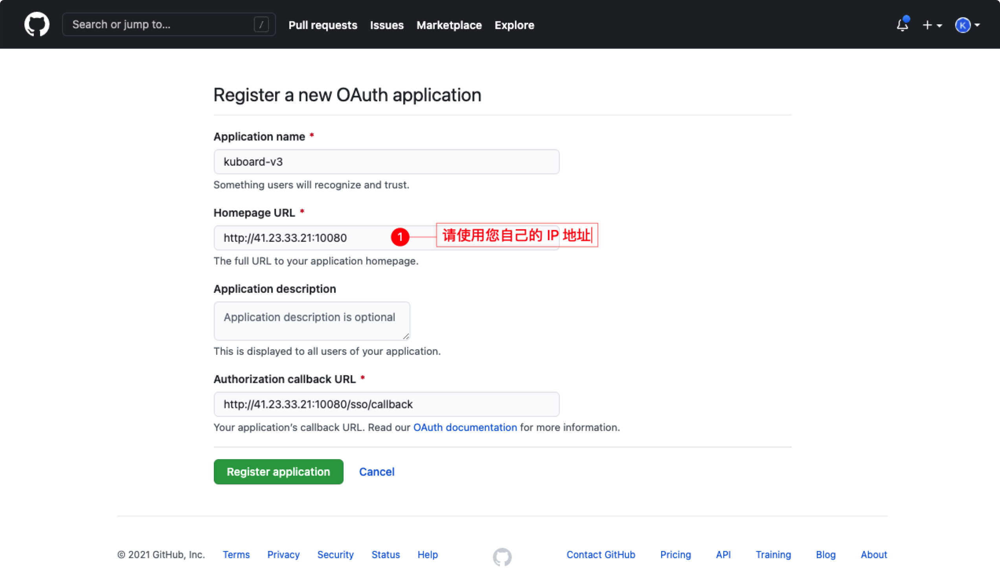

# 安装 Kuboard v3 - github

<AdSenseTitle/>


Kuboard 支持多种认证方式：

* 内建用户库
* GitLab Community Edition / GitLab Enterprise Edition / gitlab.com
* GitHub Enterprise / github.com
* LDAP

本文描述了如何配置 Kuboard v3 使其与 github.com / github ee 实现单点登录。

## 前提条件

* 用于安装 Kuboard v3.0 的机器已经安装了 docker，并且版本不低于 docker 19.03
* 您已经有自己的 Kubernetes 集群，并且版本不低于 Kubernetes v1.13
* 您已经安装好了 github ee 或者您打算直接使用 github.com 中的账号

## 部署计划

在正式安装 kuboard v3 之前，需做好一个简单的部署计划的设计，在本例中，各组件之间的连接方式，如下图所示：

* 用户通过 https://github.com 访问 github.com；

* 用户通过 `http://外网IP:10080` 访问 Kuboard v3；

* Kuboard 通过 https://github.com 访问 GitHub API；

* 安装在 Kubernetes 中的 Kuboard Agent 通过 `内网IP:10080` 访问 Kuboard 的 Web 服务端口 80 / 443 和 Kuboard Agent Server 端口 10081。


本例子中，假设：

* 您已经准备好了一个 Linux 服务器用于安装 Kuboard-V3
* 您将要配置 Kuboard 使用 github.com 实现单点登录
  * 也可以支持自己本地安装的 GitHub Enterprise Edition


## 准备 GitHub

* 在 github.com （或者 github ee）中导航到 ***Settings / Developer settings*** 菜单，如下图所示：

  

* 在 ***Settings / Developer settings*** 菜单中导航到 ***OAuth Apps*** 菜单，如下图所示：

  

* 在上图中点击 ***New OAuth App***，并填写如下表单：

  | 字段名称                   | 字段取值                                  | 字段描述                                                     |
  | -------------------------- | ----------------------------------------- | ------------------------------------------------------------ |
  | Application name           | kuboard-v3                                | 标识用，填写任意名称即可                                     |
  | Homepage URL               | http://外网IP:10080              | 根据 [部署计划](#部署计划)，此处应该填写 http://外网IP:10080 |
  | Application description    | Kuboard v3.0.0                            | 描述，可以为空                                               |
  | Authorization callback URL | http://外网IP:10080/sso/callback | 根据 [部署计划](#部署计划)，此处应该填写 http://外网IP:10080/sso/callback，`/sso/callback` 为 Kuboard 中处理 OAuth 回调的 URL 路径 |

  

* 在上图中点击 ***Register application*** 按钮之后，将进入新创建的 OAuth application 的详情页面，在该页面可以获得 ***Client ID*** 和 ***Client Secret*** 两个字段，如下图所示：

  


## 启动 Kuboard 

使用如下命令启动 Kuboard v3：
``` sh
sudo docker run -d \
  --restart=unless-stopped \
  --name=kuboard \
  -p 10080:80/tcp \
  -p 10081:10081/udp \
  -p 10081:10081/tcp \
  -v /root/kuboard-data:/data \
  -e KUBOARD_LOGIN_TYPE="github" \
  -e KUBOARD_ENDPOINT="http://内网IP:10080" \
  # 内网 IP 不能是 127.0.0.1 或者 localhost \
  -e KUBOARD_AGENT_SERVER_UDP_PORT="10081" \
  -e KUBOARD_AGENT_SERVER_TCP_PORT="10081" \
  -e KUBOARD_ROOT_USER="shaohq" \
  -e GITHUB_CLIENT_ID="17577d45e4de7dad88e0" \
  -e GITHUB_CLIENT_SECRET="ff738553a8c7e9ad39569c8d02c1d85ec19115a7" \
  eipwork/kuboard:v3
  # 也可以使用镜像 swr.cn-east-2.myhuaweicloud.com/kuboard/kuboard:v3 ，可以更快地完成镜像下载。
```

::: danger 
* KUBOARD_ENDPOINT 参数的作用是，让部署到 Kubernetes 中的 `kuboard-agent` 知道如何访问 Kuboard Server；
* KUBOARD_ENDPOINT 中也可以使用外网 IP；
* 建议在 KUBOARD_ENDPOINT 中使用域名；
* 如果使用域名，必须能够通过 DNS 正确解析到该域名，如果直接在宿主机配置 `/etc/hosts` 文件，将不能正常运行；
:::

::: tip 参数说明
* 建议将此命令保存为一个 shell 脚本，例如 `start-kuboard.sh`，后续升级 Kuboard 或恢复 Kuboard 时，需要通过此命令了解到最初安装 Kuboard 时所使用的参数；
* 第 4 行，Kuboard v3.0 需要暴露 `80` 端口，如安装指令的第三行所示，默认映射到了宿主机的 `10080` 端口，您可以根据自己的情况选择宿主机的其他端口；
* 第 5、6 行，Kuboard v3.0 需要暴露 `10081` 端口 TCP / UDP，默认映射到了宿主机的 `10081` 端口，您可以根据自己的情况选择宿主机的其他端口；
* 第 7 行，Kuboard v3.0 的持久化数据存储在 `/data` 目录，默认映射到了宿主机的 `/root/kuboard-data` 路径，请根据您自己的情况进行调整；
* 第 8 行，将 Kuboard v3.0 与 GitHub 进行单点登录集成时，必须指定环境变量 `KUBOARD_LOGIN_TYPE` 为 `github` （适用于 github.com / github-ee）；
* 第 9 行，必须指定 `KUBOARD_ENDPOINT` 环境变量为访问 Kuboard 界面的 URL；（如 [部署计划](#部署计划) 中所描述，本例子中，使用 `http://内网IP:10080` 作为通过执行此命令启动的 Kuboard 的访问 URL）；此参数不能以 `/` 结尾；
* 第 10、11 行，指定 KUBOARD_AGENT_SERVER 的端口为 `10081`，此参数与第 5、6 行中的宿主机端口应保持一致，修改此参数不会改变容器内监听的端口 `10081`；
* 第 12 行，必须指定 `KUBOARD_ROOT_USER`，使用该 GitHub 用户登录到 Kuboard 以后，该用户具备 Kuboard 的所有权限；
* 第 13 行，必须指定 `GITHUB_CLIENT_ID`，该参数来自于 [准备 GitHub](#准备-github) 步骤中创建的 GitHub OAuth Application 的 `Client ID` 字段
* 第 14 行，必须指定 `GITHUB_CLIENT_SECRET`，该参数来自于 [准备 GitHub](#准备-github) 步骤中创建的 GitHub OAuth Application 的 `Client Secret` 字段
:::

::: tip GitHub EE
上面的命令行可以用于和 github.com 集成，如果您使用 GitHub Enterprise，需要在命令行中增加如下两个参数：
* `GITHUB_HOSTNAME`，GitHub Enterprise 的 hostname，如
  ```sh
  -e GITHUB_HOSTNAME="github.this-is-a-sample.com"
  ```
* `GITHUB_ROOT_CA`，如果您的 GitHub Enterprise 使用了自签名证书，则需要指定 GITHUB_ROOT_CA，否则，可以忽略此参数，如：
  ```sh
  -v /path/to/your/rootca.crt:/github-root-ca.crt
  -e GITHUB_ROOT_CA="/github-root-ca.crt"
  ```
:::


## 访问 Kuboard 界面

* 在浏览器中输入 `http://外网IP:10080`，您将被重定向到 GitHub 登录界面；
* 在 GitHub 登录界面使用 docker run 命令中 `KUBOARD_ROOT_USER` 参数指定的用户完成登录后，GitHub 将提示您是否授权访问 Kuboard，如下图所示：

  

* 点击上图中的 ***Authorize*** 按钮后，您将成功登录 Kuboard 界面。

## 授权用户访问 Kuboard

默认情况下，只有 `KUBOARD_ROOT_USER` 参数指定的用户可以执行 Kuboard 中的所有操作，其他用户通过单点登录进入 Kuboard 系统后，除了退出系统，几乎什么事情也做不了。为了让单点登录的用户获得合适的权限，您需要在 Kuboard 中为对应的用户/用户组授权。请参考 [为单点登录的用户/用户组授权](./auth-user-sso.html)
